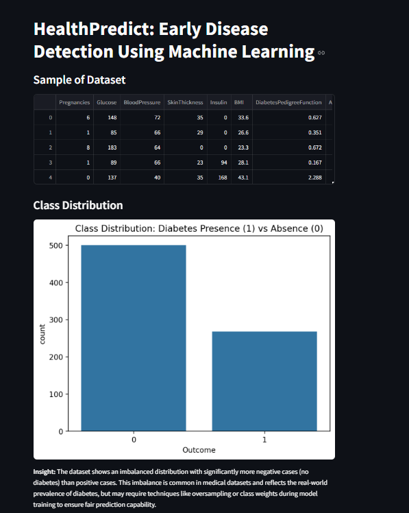
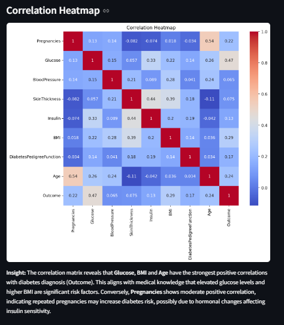
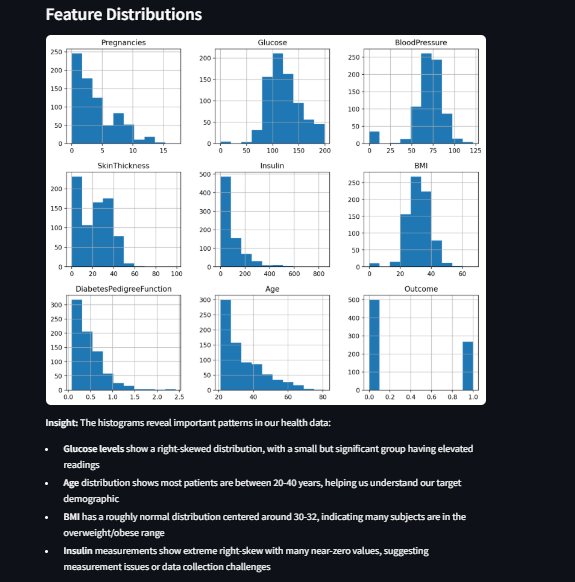
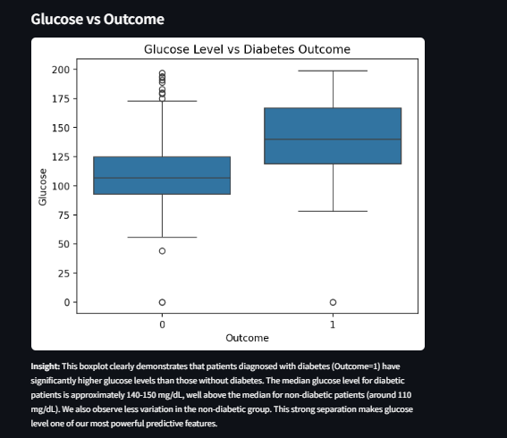
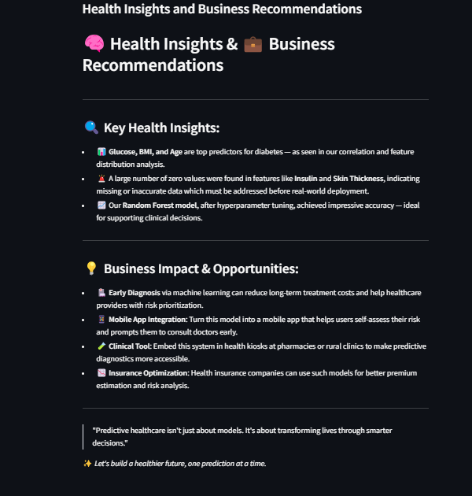

# DiabetesPredictAI

> Early diabetes detection platform powered by machine learning


---

## 📌 Overview

**DiabetesPredictAI** is a powerful, interactive web-based tool that uses machine learning to assess diabetes risk. Designed for use by healthcare providers, researchers, and the general public, this tool facilitates early detection and informed clinical decision-making, ultimately contributing to better health outcomes.

---

## ✨ Features

- 📊 **Interactive Dashboard**: User-friendly Streamlit interface for real-time exploration.
- 📈 **Data Visualizations**: Correlation heatmaps, distribution plots, and outcome comparisons.
- 🧠 **Robust Machine Learning**: Tuned Random Forest classifier for accurate predictions.
- 🩺 **Clinical Insights**: Health insights derived from data aligned with medical standards.
- 🛠️ **Production-Ready**: Exportable models, suitable for integration in clinical software or mobile health apps.

---

## 🔍 Dataset

Utilizes the trusted **Pima Indians Diabetes Dataset**, which includes:

- `Pregnancies`
- `Glucose`
- `BloodPressure`
- `SkinThickness`
- `Insulin`
- `BMI`
- `DiabetesPedigreeFunction`
- `Age`
- `Outcome` (target variable indicating diabetes presence)

---

## 📊 Visualizations

Gain deep insights with visual aids:

### ✅ Class Distribution


### 🔥 Correlation Heatmap


### 📉 Feature Distributions


### 📦 Glucose Level vs Outcome


### 🩺 Health Insights & Recommendations


---

## 🤖 Model Performance

The tuned Random Forest model demonstrates:

- 🔍 **High Accuracy**: Reliable predictions across the test dataset
- 🧪 **Clinical Balance**: Strong precision and recall for real-world applicability
- 📌 **Feature Importance**: Easily explainable model to support transparency in healthcare

---

## 🚀 Getting Started

### 📋 Prerequisites
- Python 3.7 or later
- Libraries: `streamlit`, `pandas`, `numpy`, `matplotlib`, `seaborn`, `scikit-learn`

### 🛠️ Installation

1. Clone this repository:
```bash
git clone https://github.com/yourusername/DiabetesPredictAI.git
cd DiabetesPredictAI
```

2. Install dependencies:
```bash
pip install -r requirements.txt
```

3. Launch the app:
```bash
streamlit run app.py
```

---

## 💡 Contribution & License

- Contributions are welcome! Open a pull request to add features or fix bugs.
- Distributed under the MIT License. See `LICENSE` for more information.

---

## 🙌 Acknowledgments

- Pima Indians Diabetes Dataset – [UCI Machine Learning Repository](https://archive.ics.uci.edu/ml/datasets/Pima+Indians+Diabetes)
- Open-source libraries used in the project

---

_"Empowering predictive healthcare through data and AI."_
